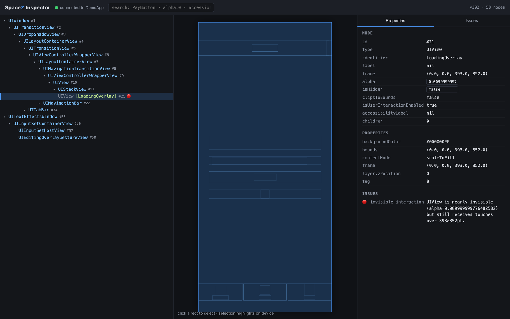
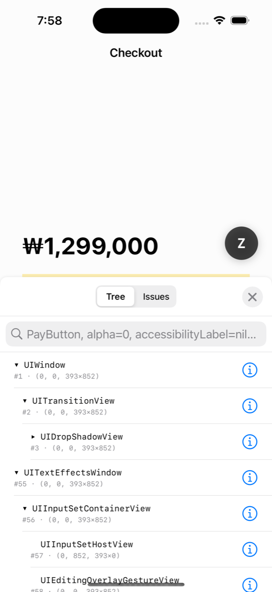
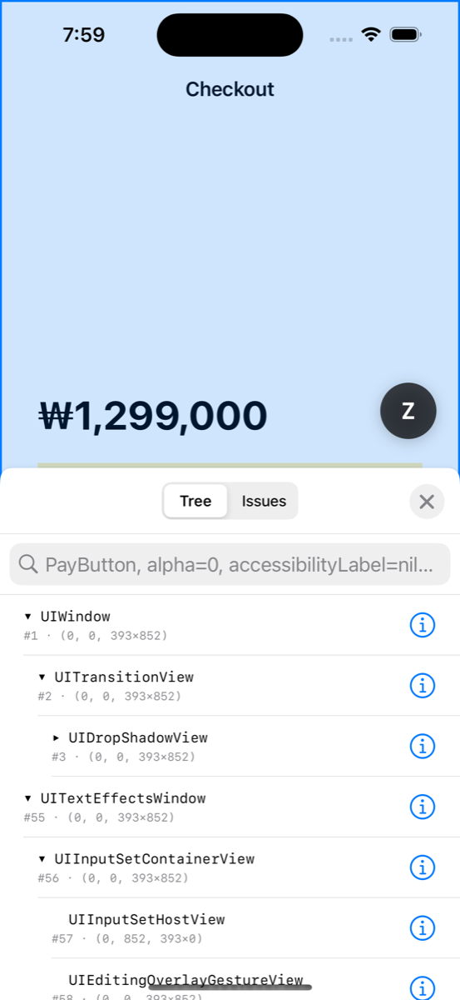

# SpaceZ

**A Flipper-class UI debugging platform for iOS, in one SPM package.**

[](https://github.com/snailer-team/SpaceZ/actions/workflows/ci.yml)


QA reports: *"The Pay button is visible but doesn't respond."*
The screenshot looks fine. `isHidden` is false, `alpha` is 1. On device, taps go nowhere.

SpaceZ answers the question a screenshot can't: **what objects is this screen
actually made of, and what state is each one in?**

```
🔴 invisible-interaction
   LoadingOverlay is nearly invisible (alpha=0.01) but still receives
   touches over 393×852pt.
   → Set isUserInteractionEnabled = false while invisible, or remove
     the view instead of fading it out.
```

*The browser inspector, one URL away — live tree, frame canvas, properties,
and the planted bug caught by the rule engine:*



| In-app inspector (`presentInspector()` or the floating **Z** button) | Browser selection highlighting live on device |
|:---:|:---:|
|  |  |

## What you get

- **In-app inspector** — floating button → live hierarchy tree, property
  inspector, search (`PayButton`, `alpha=0`, `accessibilityLabel=nil`),
  tap-to-select, on-screen highlight.
- **Remote inspector** — your app serves a web inspector; open a URL in any
  browser on the same network. Live tree with incremental updates, 2D frame
  canvas, property editing, device↔browser two-way selection. No desktop app
  to install — the "developer tool" is one embedded HTML file.
- **Automated diagnostics** — a rule engine that flags invisible
  touch-eaters, missing accessibility labels, clipped content, wrapper-view
  creep, sibling floods, and hidden-but-alive subtrees. Add your own rules
  (deprecated design-system components, experiment misconfigurations, …).
- **SwiftUI semantic tree** — best-effort reflection shows
  `ProfileCard → VStack → Text/Button` alongside the real UIKit render tree.
- **Zero dependencies. DEBUG-only by construction.**

## Quick start

**Xcode**: File → Add Package Dependencies → `https://github.com/snailer-team/SpaceZ.git`

Or in `Package.swift`:

```swift
.package(url: "https://github.com/snailer-team/SpaceZ.git", from: "1.0.0")
```

Then one call:

```swift
#if DEBUG
import SpaceZ

// In application(_:didFinishLaunchingWithOptions:) or App.init:
SpaceZDebugger.start()
// Console: [SpaceZ] Inspector → http://192.168.0.42:9394/?token=a1b2c3…
#endif
```

- Tap the floating **Z** button for the on-device inspector
  (long-press = tap-to-select).
- Open the printed URL in a browser on the same Wi-Fi for the remote
  inspector. On the simulator, `localhost` works from the same Mac.

Options:

```swift
SpaceZDebugger.start(configuration: .overlayOnly)          // no network server

var config = SpaceZConfiguration.default
config.captureThrottle = 0.5                               // fewer captures
config.remoteRedaction = .none                             // ⚠️ raw text over the network
config.writablePropertyKeys = ["alpha"]                    // shrink the write API
SpaceZDebugger.start(configuration: config)

SpaceZDebugger.register(rule: MyDeprecatedComponentRule()) // custom diagnostics
SpaceZDebugger.register(descriptor: MyFrameworkDescriptor()) // custom UI framework

SpaceZDebugger.presentInspector()   // open the panel from your own trigger
                                    // (debug menu, shake gesture, UI test)
```

Try it immediately: `open Examples/DemoApp/DemoApp.xcodeproj` — a demo app with
every bug class planted on purpose.

## Architecture

The library is the lecture-series design
(`DFS → immutable snapshot → normalized node store → partial fetch/invalidation
→ adapter → diagnostics platform`) implemented end to end:

```
┌───────────────────────── DEVICE / APP ─────────────────────────┐
│  UIKit / SwiftUI / your framework                              │
│        │                                                       │
│  ┌─────▼──────────┐   NodeDescriptor adapters — core never     │
│  │ Descriptors    │   imports a UI framework                   │
│  └─────┬──────────┘                                            │
│  MAIN  │  value copy only · p50 < 2ms for 5,000 nodes          │
│  ┌─────▼──────────┐                                            │
│  │ CaptureEngine  │──► immutable Snapshot (NodeID → node,      │
│  └─────┬──────────┘    children as [NodeID])                   │
│ ═══════╪═════════════ thread boundary ═══════════════════════  │
│  BACKGROUND                                                    │
│  ┌─────▼──────────┐  ┌────────────┐  ┌──────────────┐          │
│  │ Pipeline       │─►│ Diff       │  │ Rule Engine  │          │
│  │ (latest wins)  │  │ →invalidate│  │ →issues      │          │
│  └─────┬──────────┘  └─────┬──────┘  └──────┬───────┘          │
│        │             ┌─────▼───────────────▼───────┐           │
│  ┌─────▼─────────┐   │ Redactor → WebSocket server │           │
│  │ Overlay (UI)  │   │ (HTTP serves web client)    │           │
│  └───────────────┘   └─────────────┬───────────────┘           │
└────────────────────────────────────┼───────────────────────────┘
                                     │  getRoot / getNodes(ids) /
                                     │  invalidate / search /
                                     │  highlight / setProperty
                          ┌──────────▼──────────┐
                          │  Browser inspector  │
                          │  tree·canvas·props  │
                          └─────────────────────┘
```

### The five design decisions that matter

1. **Main thread copies values; everything else runs behind it.** UIKit is
   main-thread-only (correctness), and the debugger must not distort what it
   measures (performance). Budget: p50 < 2 ms / p95 < 5 ms / hard 8 ms per
   5,000-node capture. Measured on CI every run; captures that exceed the
   budget log a warning at runtime.
2. **Normalized node store, not a nested tree.** `nodes[id]` is O(1);
   children are `[NodeID]`. That's what makes partial fetch, search indexes,
   and subtree invalidation cheap — the same shape Flipper's protocol used.
3. **Identity IDs + invalidation, not tree diffing.** A full snapshot is
   ~1.5 MB (5,000 × 300 B); at 10 Hz that's 15 MB/s. An invalidation is tens of
   bytes, and the client refetches only what it shows. Stable NodeIDs
   (object-identity-keyed, weak) turn "diff two trees" into "which IDs changed"
   — a cache-invalidation problem, solved in O(N) dictionary walks.
4. **Latest state wins.** If the UI mutates faster than a consumer drains,
   intermediate snapshots are dropped (`bufferingNewest(1)`). A debugger wants
   *now*, not a replay. (A future recording mode is a different consistency
   policy — see roadmap.)
5. **Adapters own framework knowledge.** Supporting a new UI framework is one
   `NodeDescriptor` conformance, registered at runtime. The SwiftUI semantic
   tree is "just another descriptor" — proof the abstraction holds.

### Performance, honestly

Measured by `CapturePerformanceTests` on a 5,551-node synthetic tree
(iPhone 15 Pro simulator):

| Build | p50 | p95 | vs budget (2 / 5 / 8 ms) |
|---|---|---|---|
| Debug `-Onone` (what you debug in) | ~10.5 ms | ~12 ms | over — 250 ms throttle keeps main-thread usage at ~4% |
| Optimized `-O` | **3.44 ms** | **3.80 ms** | p95 ✅, hard ✅; p50 misses the 2 ms target by 1.7× |

The runtime logs a warning whenever a capture exceeds the hard budget, so
regressions surface where they happen. CI fails any PR whose p95 crosses
50 ms on shared runners, and capture-path PRs must include before/after
numbers (see the PR template).

## Security model

A UI inspector is a data-exfiltration surface if you're careless. SpaceZ isn't:

| Layer | Guarantee |
|---|---|
| Build | `SpaceZDebugger.start()` compiles to a **no-op outside DEBUG** — the server can't ship on by accident |
| Session | Per-launch random 64-bit token required on every HTTP route and as the first WebSocket message |
| Data | **Redaction on by default** for anything leaving the device: text, titles, placeholders, accessibility values → `[REDACTED]`. `accessibilityIdentifier` survives (developer-authored, needed for search) |
| Writes | `setProperty` accepts an explicit allowlist only (`alpha`, `isHidden`, `backgroundColor` by default) |
| On-device | The overlay shows raw values — the developer already sees the screen |

## SwiftUI support: what "best-effort" means

The semantic tree comes from `Mirror` reflection over the hosted view values —
no private symbols are linked. App-defined views are expanded through `body`
(outside SwiftUI's render context, `@Environment` yields defaults; structure is
accurate, resolved values may not be). When extraction fails on some OS
release, the hosting view's real UIKit subtree is still complete and the node
carries `swiftUISemantics: unavailable on this OS version`. Breakage on new OS
versions is treated as a normal state with a graceful fallback, not a crash.

## Requirements

- iOS 16.0+
- Swift 6 toolchain (Xcode 16+)

## Roadmap

- Snapshot diffing across app versions (UI regression detection)
- Recording mode (every-event consistency, for animation debugging)
- Swizzle-based dirty tracking as opt-in instrumentation
- Accessibility audit rule pack
- Historical snapshots attached to bug reports

## Contributing

See [CONTRIBUTING.md](CONTRIBUTING.md) — including the three invariants every
PR must hold (main-thread budget, redaction-by-default, zero dependencies) and
how to add framework adapters and diagnostic rules.

## License

[MIT](LICENSE) © SnailerLab
